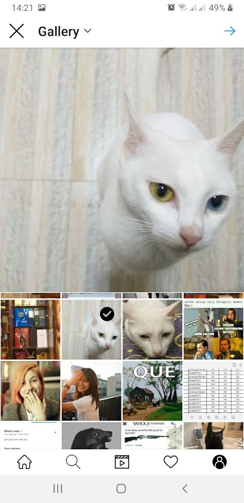

## Description
A simple android application imitates [Instagram](https://play.google.com/store/apps/details?id=com.instagram.android&hl=en&gl=US)'s features written in Kotlin.

## Screenshots

## Libraries used
* [Android Jetpack](https://developer.android.com/jetpack) 
  * [Data Binding](https://developer.android.com/topic/libraries/data-binding/)
  * [Live Data](https://developer.android.com/topic/libraries/architecture/livedata)
  * [Navigation](https://developer.android.com/guide/navigation)
  * [Room](https://developer.android.com/training/data-storage/room)
  * [ViewModel](https://developer.android.com/topic/libraries/architecture/viewmodel)
  * [WorkManager](https://developer.android.com/topic/libraries/architecture/workmanager)
* Dependency Injection
  * [Hilt](https://developer.android.com/training/dependency-injection/hilt-android) 
* Image Loading
  * [Glide](https://bumptech.github.io/glide/)
* Video Playing
  * [ExoPlayer](https://exoplayer.dev/)
* Threading & Asynchronous
  * [Kotlin Corountines](https://kotlinlang.org/docs/coroutines-overview.html) 
  * [Kotlin Flow](https://kotlinlang.org/docs/flow.html) - works well with couroutines, provide data stream which emits asynchronous values
* Networking
  * [Retrofit](https://square.github.io/retrofit/)
  * [OkHttp](https://square.github.io/okhttp/)
* Backend
  * [Firebase Authentication](https://firebase.google.com/docs/auth)
  * [Firebase Realtime Database](https://firebase.google.com/docs/database)
  * [Firebase Cloud Storage](https://firebase.google.com/docs/storage)
  * [Firebase Cloud Messaging](https://firebase.google.com/docs/cloud-messaging/)
## Features

* Share photos/videos from camera or device's Gallery via Post/Story

* View/Like/Comment on posts from other users

* Receive Comment/Like push notifications

* Search/Follow/Unfollow users

* Display/Update profile information

* (Upcoming) realtime chat between users

* (Upcoming) multiple media Post/Story as well as allow user to pick multiple photos/videos at once

